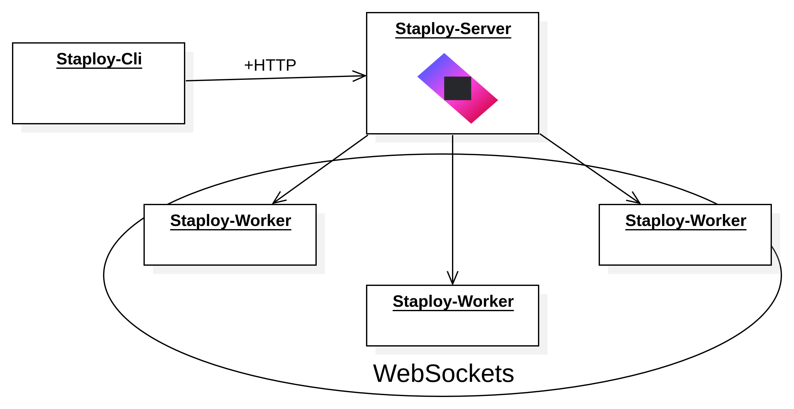

<h1 align="center">Staploy</h1>
<h3 align="center">Deploy and manage binaries across your fleet.</h3>

<p align="center">
  <em>
    A lightweight software deployment and fleet management platform for
    self-contained binaries, designed for Linux, edge devices, and
    multi-architecture environments.
  </em>
</p>

## What is Staploy?

Staploy is a lightweight software deployment and fleet management platform for
static binaries.

It consists of a central server, lightweight workers, and a CLI. Staploy
stores versioned application packages and lets you deploy, activate, update,
and remove them across individual workers or groups of workers.

Unlike container-based orchestration systems, Staploy deploys binaries directly
to the host operating system without requiring a container runtime.

## The basic workflow

1. Build your application for the architectures you need.
2. Package the binaries into a Staploy package.
3. Upload the package to the Staploy server.
4. Target one worker or a worker group.
5. Deploy and activate the desired version.

For example, simple deployments looks like:

```bash
staploy-cli create -n myapp
staploy-cli upload -f ~/path/to/package/myapp_1.0.0.tar
staploy-cli push -n myapp -e 1.0.0 -w group:production
staploy-cli set -n myapp -e 1.0.0 -w group:production
```

Or, for repeatable deployments, use a Staployfile:

```hcl
manage "myapp" {
  create {
     description = "example hcl configuration"
  }
  upload {
     path = "~/path/to/package/myapp_1.0.0.tar"
  }
}

target "production" {
  workers = ["group:production"]

  deploy "myapp" {
    version = "1.0.0"
  }
}
```

### Architecture at a Glance



- **Server** (`staploy-server`): Central registry, deployment control plane,
  RBAC enforcement, and audit logging. Communicates with workers via
  mTLS WebSocket + Protobuf.
- **Worker** (`staploy-worker`): Lightweight agent (~10MB) running on managed
  devices. Receives deployment commands, manages binary lifecycle.
- **CLI** (`staploy-cli`): Declarative HCL config or direct commands.
  Builds packages, manages registry, orchestrates deployments.

## Features

### Deployment

- Versioned application packages
- Individual or group deployment
- Push / activate separation
- Post-deploy hooks
- Version switching

### Fleet

- Worker groups
- Worker identity
- Architecture detection
- Remote shell
- Worker status

### Security

- mTLS
- RBAC
- Audit logging

### Build & Packaging

- Multi-architecture packages
- Built-in package builder
- HCL-based workflows

## When should I use Staploy?

Staploy is a good fit when you have:

- Static or mostly self-contained binaries
- Multiple Linux/Unix machines to manage
- Multiple CPU architectures
- A need for versioned binary deployment
- Edge devices or resource-constrained machines
- A preference for native processes over containers

Staploy is not intended to replace:

- **Ansible** for configuration management
- **OpenTofu/Terraform** for infrastructure provisioning
- **Kubernetes/Nomad** for general workload orchestration
- **Mender** for full embedded-device OTA updates
- **apt/yum/etc.** for operating-system package management

## Prerequisites

**Server**

- Java 21+
- Redis 6+ (8+ recommended)
- 2GB RAM minimum
- 10GB storage for artifact registry

**Worker**

- Any Unix-like OS (Linux, macOS, BSD)
- ~10MB RAM, 20MB persistent storage
- Supports: x86_64, aarch64, arm, i386, riscv64, mipsel, mips64el

**CLI**

- Linux, macOS, or Windows
- Same architecture support as worker

> **Note:** In production with 6 workers, the server instance
> uses ~520MB RAM. 2GB is the recommended minimum to allow
> headroom for fleet growth and GC overhead.
